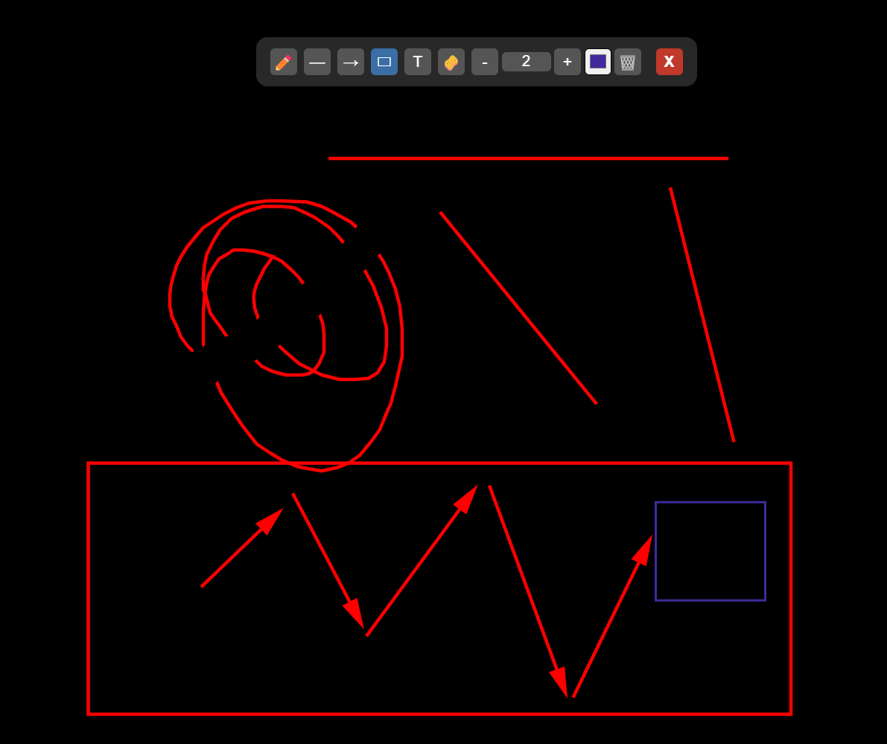

# Drawing on Screen

A simple Electron application that allows drawing basic shapes, text, and erasing directly on the screen using a transparent overlay.

## Features

*   Pencil Tool
*   Line Tool
*   Arrow Tool
*   Text Tool
*   Eraser Tool
*   Adjustable Line Width
*   Color Picker
*   Clear Canvas
*   Close Application

## Download

*   **Windows Portable:** [Download Here](https://raw.githubusercontent.com/kukoman/drawing_on_screen/master/dist/drawing-tool-portable.zip)

## Running the Application

1.  Clone the repository (if you haven't already).
2.  Navigate to the project directory: `cd drawing_on_screen`
3.  Install dependencies: `npm install`
4.  Run the application: `npm run build:win` and look into the dist folder ;)

enjoy...

*(Make sure you have Node.js and npm installed.)*

## Showcase

